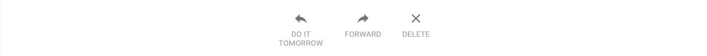
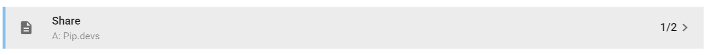
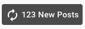
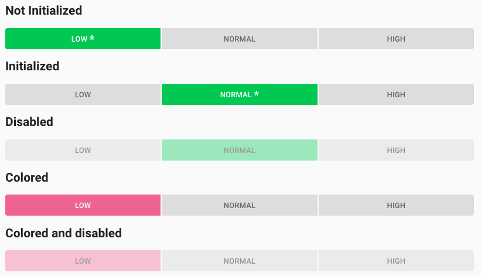

# Pip.WebUI.Controls User's Guide

## <a name="contents"></a> Contents
- [Installing](#install)
- [pip-action-list component](#action_list)
- [pip-drilldown-list component](#drilldown_list)
- [pip-refresh-button directive](#refresh_button)
- [pip-toggle-buttons directive](#toggle_buttons)
- [Questions and bugs](#issues)


## <a name="install"></a> Installing

Add dependency to **pip-webui** into your **bower.json** or **package.json** file depending what you use.
```javascript
"dependencies": {
  ...
  "pip-webui": "*"
  ...
}
```

Alternatively you can install **pip-webui** manually using **bower**:
```bash
bower install pip-webui
```

or install it using **npm**:
```bash
npm install pip-webui
```

Include **pip-webui** files into your web application.
```html
<link rel="stylesheet" href=".../pip-webui-lib.min.css"/>
<link rel="stylesheet" href=".../pip-webui.min.css"/>
...
<script src=".../pip-webui-lib.min.js"></script>
<script src=".../pip-webui.min.js"></script>
```

Register **pipButtons** module in angular module dependencies.
```javascript
angular.module('myApp',[..., 'pipButtons']);
```

## <a name="action_list"></a> pip-action-list component

**Action list** is a set of big action buttons that are placed at the bottom of a page.

### Usage
```html

<div class="pip-action-list">

    <md-button class="pip-action-list-item">
        <md-icon class="pip-pic" md-svg-icon="icons:reply"></md-icon>
        <div class="pip-title">Reply</div>
    </md-button>

    <md-button class="pip-action-list-item">
        <md-icon class="pip-pic" md-svg-icon="icons:forward"></md-icon>
        <div class="pip-title">Forward</div>
    </md-button>

    <md-button class="pip-action-list-item">
        <md-icon class="pip-pic" md-svg-icon="icons:cross"></md-icon>
        <div class="pip-title">Delete</div>
    </md-button>
</div>
```



### CSS Classes
* **pip-action-list** - general class for action list
* **pip-action-list-item** - class for item in action list
* **pip-pic** - class for icon in item
* **pip-title** - class for text

## <a name="drilldown_list"></a> pip-drilldown-list component

**Drilldown list** is a list with clickable items, that lead to detail information.

### Usage
```html
<div class="pip-drilldown-list">
    <md-button class="pip-drilldown-list-item pip-drilldown-list-item-lg pip-selected">
        <div class="pip-content">
            <md-icon md-svg-icon="icons:document" class="pip-icon"></md-icon>
            <div class="pip-subcontent flex">
                <p class="pip-title">Share</p>
                <p class="pip-subtitle flex">A: Pip.devs</p>
            </div>
            <p >1/2</p>
            <md-icon md-svg-icon="icons:chevron-right"></md-icon>
        </div>
    </md-button>
</div>
```



### CSS Classes
* **pip-title** - class for title text
* **pip-subtitle** - class for subtitle text
* **pip-drilldown-list-item-lg** - class for drilldown with tittle and subtitle
* **pip-selected** - class for highlight drilldown item

## <a name="refresh_button"></a> pip-refresh-button directive

**pip-refresh-button** shows at the top of the screen when new data is available. By clicking on it, user triggers the update. It is used as a visual confirmation of he data arrival and helps to manager user expectations.

### Usage
```html
<pip-refresh-button pip-text="refreshText" pip-visible="showRefresh" pip-refresh="onRefresh()">
</pip-refresh-button>
```



See online samples [here...](http://webui.pipdevs.com/pip-webui-buttons/index.html#/refresh)

### Attributes
* **pip-text** - string to display text in refresh toast 
* **pip-refresh** - function for updating string

## <a name="toggle_buttons"></a> pip-toggle-buttons directive

**pip-toggle-buttons** directive implement multiple radio buttons. Only one of them can be pressed at any time. On phones buttons are replaced with dropdown list.

### Usage
```html
<pip-toggle-buttons ng-model="activeButton"
                    pip-rebind="true"
                    pip-buttons="buttonsCollection">
</pip-toggle-buttons>
```



See online samples [here...](http://webui.pipdevs.com/pip-webui-buttons/index.html#/toggle_buttons)

### Attributes
* **buttonsCollection** - array buttons 
* **pip-rebind** - binding buttonsCollection array. By default equal false

## <a name="issues"></a> Questions and bugs

If you have any questions regarding the module, you can ask them using our 
[discussion forum](https://groups.google.com/forum/#!forum/pip-webui).

Bugs related to this module can be reported using [github issues](https://github.com/pip-webui/pip-webui-buttons/issues).
